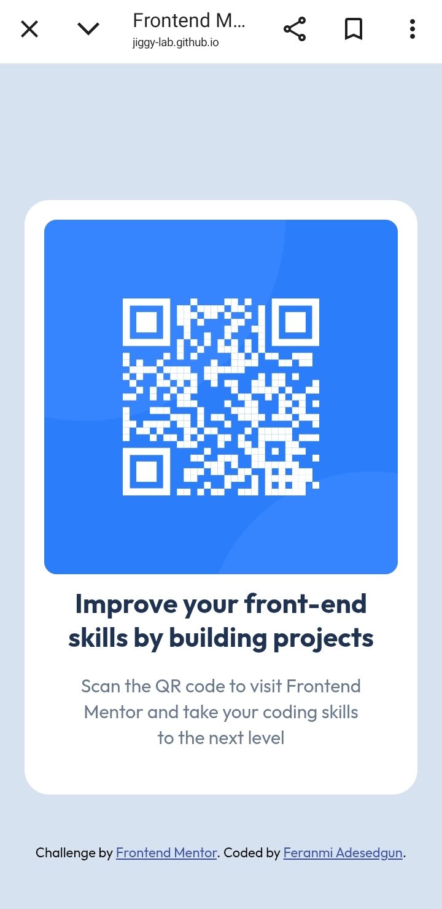

# Frontend Mentor - QR code component solution
This is a solution to the [QR code component challenge on Frontend Mentor](https://www.frontendmentor.io/challenges/qr-code-component-iux_sIO_H). Frontend Mentor challenges help you improve your coding skills by building realistic projects. 

## Table of contents- 
- [Overview](#overview)  
- [Screenshot](#screenshot)
- [Links](#links)
- [My process](#my-process)
- [Built with](#built-with)
- [What I learned](#what-i-learned) 
- [Author](#author)

## Overview 

This is a solution to the QR code component challenge on Frontend Mentor. The project focused on creating a respsonive card layout that matches a specific design provided in Figma.

### Screenshots

### Links

- Solution URL: [https://github.com/jiggy-lab/qr-code-component-](https://github.com/jiggy-lab/qr-code-component-)
  
- Live Site URL: [https://jiggy-lab.github.io/qr-code-component-/](https://jiggy-lab.github.io/qr-code-component-/)
  
## My Process

### Built with 
- Semantic HTML5 markup
- CSS custom properties
- Flexbox
- Mobile-first workflow

### What I learned 
In this project, i learnt how to properly center a component using Flexbox. I also learnt two new CSS properties, letter spacing, line height. Coupled with deploying a live site using GitHub pages. And finally, i practiced managing image paths and organising my repository.

## Author

- Frontend Mentor - [@jiggy-lab](https://www.frontendmentor.io/profile/jiggy-lab)
- GitHub - [jiggy-lab](https://github.com/jiggy-lab)
